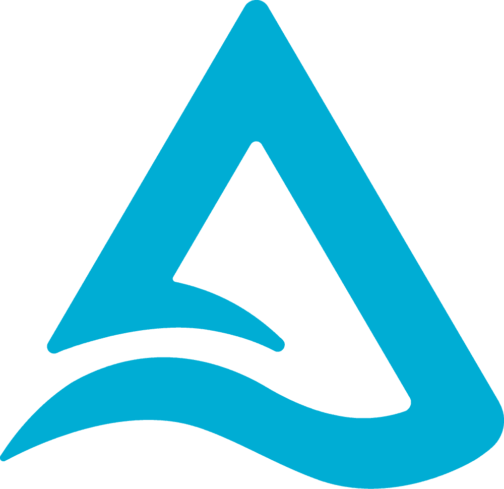

# Edtech-BE (Microservices System For Edtech Assistant)
You can access the web site from here: [Edtech Website](https://www.edtech-assistant.sbs/). 

You can find the front-end repository here: [Edtech Front-end Repository](https://github.com/anhminhnguyen3110/edtech-fe).

# Table of Contents

1. [Application Introduction](#application-introduction)
2. [Techstack](#techstack)
   - [Frontend](#frontend)
   - [Backend](#backend)
   - [AI & Data Engineering](#ai--data-engineering)
   - [DevOps](#devops)
   - [Testing](#testing)
3. [Performance Testing](#performance-testing)
4. [Micro-services architecture](#micro-services-architecture)
5. [Deployment architecture](#deployment-architecture)
6. [CI/CD pipeline](#cicd-pipeline)
7. [Traditional HTTP Request Workflow (CRUD Operations)](#traditional-http-request-workflow-crud-operations)
8. [Downstream Task Workflow (Time-Consuming Operations)](#downstream-task-workflow-time-consuming-operations)
9. [PowerPoint Generator Architecture](#powerpoint-generator)
10. [Intelligent Educational Question Answering Assistant (High-level Architecture)](#intelligent-educational-question-answering-assistant-high-level-architecture)
11. [Intelligent Educational Question Answering Assistant (Low-level Architecture)](#intelligent-educational-question-answering-assistant-low-level-architecture)
12. [Game (Websocket)](#game-websocket)
13. [Game pub/sub for auto-scaling](#game-pubsub-for-auto-scaling)

# Application Introduction

https://github.com/user-attachments/assets/dece0ded-eff1-4c5f-9665-4fa8f776bfec

# Techstack
## Frontend ([Repository](https://github.com/anhminhnguyen3110/edtech-fe))

     ReactJS |
     NextJS |
     Socket.IO |
     Material-UI |
     Search Engine Optimization (SEO) |
     Vercel

## Backend

     NestJS |
     NodeJS |
     TypeScript |
     RabbitMQ |
     Redis |
     Redis Insight |
     MySQL |
     Prometheus |
     Grafana |
     Elasticsearch 

## AI & Data Engineering    

     Large Language Model (LLM) |
     Vector Database |
     Airflow |
     dbt |
     Kafka |
     Zookeeper |
     Delta Lake |
     Scrapy |
     Selenium |
    🧠 Advanced Retriever-Augmented Generation (RAG)

## DevOps

     Kubernetes |
     Azure Kubernetes Service (AKS) |
     Helm |
     Terraform |
     Docker |
     Azure Cloud |
     Porkbun DNS Provider |
     Nginx Load Balancer |
     CertManager |
     Let's Encrypt |
    🔏 TLS Cluster Issuer |
    🚀 CI/CD |
     GitHub Actions |
     Horizontal Pod Autoscaling (HPA) |
     ELK Stack 
    ( Elasticsearch, 
     Logstash, 
     Kibana, 
     Filebeat)

## Testing

     Jest |
     K6 |
     PuppeteerJS

<!-- Divider -->
---

# Performance Testing

The application underwent stress testing using K6 to simulate real-world user interactions. The test was conducted in a cloud environment, allowing for scalable and realistic load conditions. Below are the key findings from the performance tests:

- **Stress Test Setup**:
  - The test simulated common user actions such as login requests, data fetching, and page navigation.
  - The test was conducted by incrementally increasing the number of concurrent users, starting from 1,000.

- **Test Results**:
  - A **peak test** was conducted over the course of one hour, gradually pushing the system to its limit.
  - At **85,000 concurrent users**, response times began to slow down, but no critical issues were observed.

  - At **90,000 concurrent users**, the application was pushed to its limit, leading to severe performance degradation, including slower response times, increased error rates, and eventual system failure.

# Micro-services architecture

For more detailed explanations, see [here](docs/microservice.md).

# Deployment Architecture

For more detailed explanations, see [here](docs/deployment.md).

# CI/CD pipeline

For more detailed explanations, see [here](docs/ci_cd.md).

# Traditional HTTP Request Workflow (CRUD Operations)

For more detailed explanations, see [here](docs/http_workflow.md).

# Downstream Task Workflow (Time-Consuming Operations)

For more detailed explanations, see [here](docs/downstream_workflow.md).

# PowerPoint generator

For more detailed explanations, see [here](docs/powerpoint.md).

# Intelligent Educational Question Answering Assistant (High-level Architecture)

This architecture is designed to build a **Intelligent Educational Question Answering Assistant** for the education domain, using a **Retrieval-Augmented Generation (RAG)** approach. The design integrates several advanced techniques, including **HyDE**, **CRAG**, and **Fusion RAG**, to enhance the system's ability to handle complex queries and provide accurate, domain-specific responses. Below is an explanation of the workflow and components involved in this architecture:

For more detailed explanations, see [here](docs/qa_high.md).

# Intelligent Educational Question Answering Assistant (Low-level Architecture)

The low-level architecture described focuses on an **ETL (Extract, Transform, Load)** process, **Real-time Data Serving**, and a **RAG (Retrieval-Augmented Generation) Pipeline**. The system is designed to gather and process data from educational websites, ingest user-provided documents (such as PDFs), and integrate these inputs into a retrieval-augmented response system using advanced models like Large Language Models (LLMs) and query expansion techniques. Below is a breakdown of the major components and how they work together.

For more detailed explanations, see [here](docs/qa_low.md).

# Game (websocket)

This architecture represents a scalable system designed to handle multiplayer game sessions involving teachers and students, where real-time communication is facilitated through **WebSockets**. The system is distributed across multiple servers, with **Redis** acting as the central communication bridge to synchronize sessions across different nodes. Below is a detailed breakdown of how the architecture works.

For more detailed explanations, see [here](docs/game.md).

# Game pub/sub for auto-scaling

This architecture represents a scalable system designed to handle multiplayer game sessions involving teachers and students, where real-time communication is facilitated through **WebSockets**. The system is distributed across multiple servers, with **Redis** acting as the central communication bridge to synchronize sessions across different nodes and using **Pub/Sub** pattern for auto-scaling. Below is a detailed breakdown of how the architecture works.

For more detailed explanations, see [here](docs/game_pub.md).
