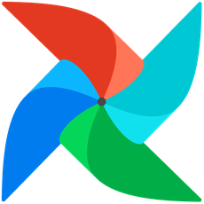
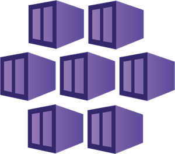

# Edtech-BE (Microservices System For Edtech Assistant)
You can access the web site from here: [Edtech Website](https://www.edtech-assistant.sbs/). 

You can find the front-end repository here: [Edtech Front-end Repository](https://github.com/anhminhnguyen3110/edtech-fe).

# Table of Contents

1. [Application Introduction](#application-introduction)
2. [Techstack](#techstack)
   - [Frontend](#frontend)
   - [Backend](#backend)
   - [AI & Data Engineering](#ai--data-engineering)
   - [DevOps](#devops)
   - [Testing](#testing)
3. [Performance Testing](#performance-testing)
4. [All Diagrams](#all-diagrams)
5. [Micro-services architecture](#micro-services-architecture)
6. [Deployment architecture](#deployment-architecture)
7. [CI/CD pipeline](#cicd-pipeline)
8. [Traditional HTTP Request Workflow (CRUD Operations)](#traditional-http-request-workflow-crud-operations)
9. [Downstream Task Workflow (Time-Consuming Operations)](#downstream-task-workflow-time-consuming-operations)
10. [PowerPoint Generator Architecture](#powerpoint-generator)
11. [Intelligent Educational Question Answering Assistant (High-level Architecture)](#intelligent-educational-question-answering-assistant-high-level-architecture)
12. [Intelligent Educational Question Answering Assistant (Low-level Architecture)](#intelligent-educational-question-answering-assistant-low-level-architecture)
13. [Game (Websocket)](#game-websocket)
14. [Game pub/sub for auto-scaling](#game-pubsub-for-auto-scaling)

# Application Introduction

https://github.com/user-attachments/assets/dece0ded-eff1-4c5f-9665-4fa8f776bfec

# Techstack
## Frontend ([Repository](https://github.com/anhminhnguyen3110/edtech-fe))

     ReactJS |
     NextJS |
     Socket.IO |
     Material-UI |
     Search Engine Optimization (SEO) |
     Vercel

## Backend

     NestJS |
     NodeJS |
     TypeScript |
     RabbitMQ |
     Redis |
     Redis Insight |
     MySQL |
     Prometheus |
     Grafana |
     Elasticsearch 

## AI & Data Engineering    

     Large Language Model (LLM) |
     Vector Database |
     Airflow |
     dbt |
     Kafka |
     Zookeeper |
     Delta Lake |
     Scrapy |
     Selenium |
    🧠 Advanced Retriever-Augmented Generation (RAG)

## DevOps

     Kubernetes |
     Azure Kubernetes Service (AKS) |
     Helm |
     Terraform |
     Docker |
     Azure Cloud |
     Porkbun DNS Provider |
     Nginx Load Balancer |
     CertManager |
     Let's Encrypt |
    🔏 TLS Cluster Issuer |
    🚀 CI/CD |
     GitHub Actions |
     Horizontal Pod Autoscaling (HPA) |
     ELK Stack 
    ( Elasticsearch, 
     Logstash, 
     Kibana, 
     Filebeat)

## Testing

     Jest |
     K6 |
     PuppeteerJS

<!-- Divider -->
---

# Performance Testing

The application underwent stress testing using K6 to simulate real-world user interactions. The test was conducted in a cloud environment, allowing for scalable and realistic load conditions. Below are the key findings from the performance tests:

- **Stress Test Setup**:
  - The test simulated common user actions such as login requests, data fetching, and page navigation.
  - The test was conducted by incrementally increasing the number of concurrent users, starting from 1,000.

- **Test Results**:
  - A **peak test** was conducted over the course of one hour, gradually pushing the system to its limit.
  - At **85,000 concurrent users**, response times began to slow down, but no critical issues were observed.

  - At **90,000 concurrent users**, the application was pushed to its limit, leading to severe performance degradation, including slower response times, increased error rates, and eventual system failure.

# All Diagrams

**Back-end Microservice Architecture**

**Kubernetes Deployment Architecture**

**CI/CD pipeline for auto deployment and integration**

**Traditional HTTP Request Workflow (CRUD Operations)**

**Downstream Task Workflow (Time-Consuming Operations)**

**PowerPoint generator**

**Intelligent Educational Question Answering Assistant (High-level Architecture)**

**Intelligent Educational Question Answering Assistant (Low-level Architecture)**

**ETL + Feature Engineering for Real-Time Data Serving**

**Game (Websocket)**

**Game pub/sub for auto-scaling**

# Micro-services architecture

- **API Gateway Service**:
    - Centralized entry point for all client interactions (mobile, web).
    - Handles authentication, rate limiting, and routing.
    - Alternatives: **Backend for Frontend (BFF)** or direct microservice communication.
- **RabbitMQ**:
    - Message broker enabling asynchronous communication between services.
    - Simplifies task management and service decoupling.
    - Alternatives: **Apache Kafka** for high-throughput, event-driven architectures.
- **Job Handler Service**:
    - Manages background tasks like file processing and quiz generation.
    - Prevents these tasks from blocking other services.
    - Alternatives: Serverless architectures like **AWS Lambda** for reduced management overhead.
- **File System (Stage Area & Main Area)**:
    - Handles temporary and permanent file storage.
    - Alternatives: **Cloud-based storage** (AWS S3, Azure Blob) for better scalability.
- **Cache**:
    - Speeds up frequently accessed data, improving performance.
    - Alternatives: **Redis** or **Memcached**, with Redis offering advanced features like persistence.
- **Quiz Service**:
    - Facilitates AI-generated quizzes for student assessments.
    - Could be split into smaller microservices as complexity increases.
- **Assignment Service**:
    - Handles assignment submissions, grading, and issue extraction via AI.
    - Can scale by dividing into more specialized microservices.
- **Chat Service**:
    - Real-time support with web searches and file processing.
    - Alternatives: WebSocket-based solutions (SignalR) for enhanced real-time communication.
- **Vector Database**:
    - Stores AI embeddings and vectorized data for personalized learning.
    - Alternatives: **Pinecone**, **FAISS** for scalable similarity search.
- **Relational Database with Replicas**:
    - Provides high availability, consistency, and fault tolerance for data storage.
    - Alternatives: **NoSQL databases** (MongoDB) or **distributed databases** (CockroachDB) for unstructured data needs.
- **API Gateway Pattern**:
    - Simplifies service interaction, security, and routing.
    - Alternatives: **Saga Pattern** for managing distributed transactions or **Event-Driven Architecture** for real-time service updates.
- **RabbitMQ vs Kafka**:
    - RabbitMQ: Suitable for task queues, low-latency message routing.
    - Kafka: Better for high-throughput, real-time event streaming and logging.
- **Potential Improvements**:
    - Use **serverless** for tasks (e.g., Job Handler).
    - Adopt **CQRS** or **event sourcing** for scalability and performance.
    - Implement **service mesh** (Istio/Linkerd) for better communication management and observability between services.

# Deployment architecture

### 1. Kubernetes Cluster & Microservices with Horizontal Autoscaling

At the core of this architecture is the **Kubernetes Cluster**, which is responsible for orchestrating the deployment, scaling, and management of the EdTech Assistant’s services. **Kubernetes’ Horizontal Pod Autoscaling** allows the system to automatically scale its microservices based on the load, ensuring that the system remains responsive and available during periods of high usage, such as when many students are taking quizzes or submitting assignments simultaneously.

### Microservices

- **API Gateway Service**: This service acts as the front door to the backend services, routing incoming API requests from the frontend or external systems to the appropriate microservice. The API Gateway also performs critical functions such as request validation, load balancing, rate limiting, and security (e.g., authentication and authorization).
- **Assignment Service**: Manages the creation, submission, and grading of student assignments. This service handles data-intensive tasks like processing submitted documents and running any automated grading algorithms. It scales horizontally to ensure smooth handling of many simultaneous submissions.
- **Quiz Service**: Generates quizzes, handles quiz submissions, and tracks student performance. As quizzes are a key feature of the platform, this service needs to dynamically scale based on user activity.
- **Chat Service**: Facilitates real-time communication between teachers and students, supporting interactive learning sessions, discussions, and student queries. This service must be low-latency to ensure instant messaging.

### Autoscaling

Kubernetes provides **Horizontal Pod Autoscaling (HPA)** for the core microservices. This allows services such as the **Quiz Service**, **Assignment Service**, and **Chat Service** to automatically adjust their pod count based on current traffic and CPU utilization. For example, during peak times—like when a large number of students are submitting assignments—the system will automatically spin up more instances (pods) of the **Assignment Service** to handle the additional load.

- **API Gateway Service**, **Assignment Service**, **Quiz Service**, and **Chat Service** all benefit from HPA to ensure the platform remains performant, even under varying loads.
- **RabbitMQ** is used for messaging between services. It acts as a message broker, allowing services to communicate asynchronously, thus decoupling service dependencies. This is especially useful in scenarios where real-time responses are not needed but reliability and message delivery are critical, such as processing quiz results or sending notifications.
- **Redis** is employed as a caching layer to improve the speed of frequently accessed data. For example, it can cache quiz results, session data, or frequently accessed educational materials. Redis is highly performant and ensures that responses are quick, even under high load.
- **Prometheus** is used for gathering real-time metrics from each of these microservices, helping the system monitor the health and performance of each service. This ensures that autoscaling decisions are based on accurate, up-to-date information.

### 2. TLS Issuer & Load Balancer for Secure Traffic Management

Security is a core aspect of the EdTech Assistant platform, and managing secure connections via TLS certificates is a key requirement. The architecture includes a **TLS Issuer and Load Balancer** system that handles secure communication between users and the backend services.

- **Vercel** is used as the frontend platform for hosting and delivering the web interface. All user interactions, such as teachers and students accessing the platform, are routed through Vercel to the backend services managed in the Kubernetes cluster.
- **Nginx Ingress Controller**: This component sits at the edge of the Kubernetes cluster and is responsible for managing external access to the internal services. It serves as the entry point for all HTTP and HTTPS requests. The Nginx controller integrates with **Let’s Encrypt** to handle the automated issuing and renewal of **TLS certificates**, ensuring all communication between clients (teachers, students) and the platform is encrypted and secure.
- **Let's Encrypt & Cert Manager**: The **Cert Manager** is used within Kubernetes to automate the management and renewal of SSL/TLS certificates through **Let's Encrypt**. It works alongside the Nginx Ingress Controller to request certificates for services running in the cluster, ensuring that all communication is secure and HTTPS is enforced across the system.
- **Porkbun DNS Provider**: The **DNS Mapper** from **Porkbun** is responsible for resolving domain names to the correct services. It ensures that users can access the platform securely by verifying domain ownership and pointing the domain to the Vercel platform, while also ensuring that the certificate requests are correctly mapped to the domain.

### 3. ELK Stack for Centralized Logging and Monitoring

For logging and observability, the architecture includes the **ELK Stack** (Elasticsearch, Logstash, and Kibana). This ensures that logs generated by the microservices are captured, processed, and visualized in a developer-friendly manner.

- **Filebeat**: This lightweight log shipper is deployed as a DaemonSet in the Kubernetes cluster, ensuring that logs from all pods are collected and forwarded to **Logstash** for processing.
- **Logstash**: Processes and enriches the logs received from Filebeat before forwarding them to **Elasticsearch**. Logstash can filter, transform, and enhance logs, making them more structured and easier to search.
- **Elasticsearch**: Acts as a distributed search and analytics engine, storing and indexing all logs from the services. It enables fast search capabilities and analytics, which are vital for debugging and monitoring performance.
- **Kibana**: A visualization layer that sits on top of Elasticsearch, allowing developers to search through logs, create dashboards, and visualize metrics such as error rates, latency, or system behavior. It provides real-time insights into the system's performance and health, helping developers track down issues efficiently.

### 4. Prometheus & Grafana for Metrics and Visualization

**Prometheus** and **Grafana** form the core of the monitoring and alerting system. Prometheus collects detailed metrics from every component in the cluster, allowing for deep insights into performance and potential bottlenecks.

- **Prometheus**: Scrapes metrics from Kubernetes nodes and microservices, including data such as CPU usage, memory consumption, request rates, and error counts. These metrics are crucial for making informed scaling decisions and for detecting anomalies in the system's behavior.
- **Grafana**: Visualizes the metrics collected by Prometheus in customizable dashboards. Developers and administrators can view real-time data on resource utilization, request performance, and service health. Grafana allows users to create alerts based on specific thresholds, ensuring proactive detection and resolution of issues before they affect users.
- **Metric Server**: Works in tandem with Prometheus to collect resource usage data at the pod and node levels. The **Metric Server** feeds this data into Kubernetes’ Horizontal Pod Autoscaler to automatically adjust the number of running pods based on CPU or memory usage, ensuring that the system remains responsive during peak loads.

### 5. Horizontal Pod Autoscaling for Dynamic Resource Management

Kubernetes' **Horizontal Pod Autoscaling (HPA)** is central to this architecture’s ability to handle fluctuating workloads efficiently. By automatically adjusting the number of pods running each microservice based on real-time demand, the platform ensures optimal resource usage.

- **API Gateway Service**, **Assignment Service**, **Quiz Service**, and **Chat Service** are all configured with HPA to scale in response to varying load conditions. This dynamic scaling helps avoid service degradation or downtime during periods of high usage, such as exam periods or assignment deadlines.
- **Prometheus metrics** drive these autoscaling decisions, with thresholds set to ensure that the services scale up when CPU or memory usage reaches critical levels. Once the demand subsides, HPA scales the services back down to conserve resources.

# CI/CD pipeline

### **1. Development (VSCode)**:

- **Developers** use **Visual Studio Code (VSCode)**, a widely used code editor for writing, editing, and debugging code for the *EdTech Assistant* project. This IDE provides various extensions and integrations, such as Git for version control and Docker for container management, which streamline the developer experience.
- In this stage, developers work on new features, bug fixes, or optimizations. Once development is complete, the code is ready for the next stage: version control.

### 2. **Commit Code (App Repository)**:

- After completing the code changes, developers push their code to the central **App Repository**, managed using **Git** (likely hosted on GitHub, GitLab, or Bitbucket).
- Committing code ensures that all changes are version-controlled and traceable, allowing the team to keep track of modifications and enabling collaboration across the development team. Every time code is pushed or merged into a specified branch (like `main` or `develop`), it triggers the CI/CD pipeline, starting with GitHub Actions.

### 3. **Trigger (GitHub Action)**:

- The commit event automatically triggers a **GitHub Action**, which is an automation tool built into GitHub to facilitate Continuous Integration and Continuous Delivery (CI/CD). GitHub Actions allow developers to define custom workflows that automate tasks like testing, building, and deploying the application.
- In this case, GitHub Action pulls the latest code from the App Repository and begins executing predefined tasks such as building a Docker image and running tests.

### 4. **Build Image**:

- As part of the **build phase**, GitHub Actions takes the application code and packages it into a **Docker image**. Docker images contain everything the application needs to run, including code, runtime, libraries, and system tools.
- The use of Docker ensures that the application will run consistently across different environments, from development machines to production, by encapsulating all dependencies within the image.
- Docker also allows for containerized deployment, which is particularly useful when running applications in **Kubernetes** clusters.

### 5. **Jest Unit Testing**:

- After building the Docker image, GitHub Actions runs **Jest** unit tests to ensure that the code is functioning correctly and that no new bugs were introduced. Jest is a popular testing framework for JavaScript applications and is used to validate the correctness of individual components and functions.
- By incorporating unit tests in the pipeline, we catch potential issues early in the process before the code is deployed to production. If tests fail, the pipeline stops, preventing faulty code from progressing further down the pipeline.
- Successful tests allow the pipeline to proceed to the next step, ensuring code quality and stability.

### 6. **Push Image to Docker Hub (Docker Image Registry)**:

- After successful testing, the Docker image is pushed to the **Docker Hub** (or any other Docker image registry). Docker Hub serves as a centralized repository for Docker images, where they can be stored and accessed by different environments (e.g., development, staging, and production).
- This step is a crucial part of **Continuous Integration** because it ensures that the latest version of the application, along with all necessary dependencies, is available for deployment at any time.
- By storing the image in a registry, other systems (such as Kubernetes clusters) can pull and run the exact version of the application defined by the image.

### 7. **Build Kubernetes Manifest**:

- In parallel, GitHub Actions generates or updates a **Kubernetes manifest** file. A Kubernetes manifest defines the desired state of the application when deployed to a Kubernetes cluster, including the number of pods, services, resource limits, environment variables, and more.
- The manifest file is essentially a blueprint for Kubernetes that instructs the cluster how to deploy the Docker container in a production environment. The **Kubernetes manifest** allows for efficient scaling, high availability, and fault tolerance by defining how Kubernetes manages the application.

### 8. **Pull Image (Azure Kubernetes Cluster)**:

- Once the Docker image is pushed to Docker Hub, the **Azure Kubernetes Cluster (AKS)** pulls the image based on the instructions in the Kubernetes manifest. AKS is a managed Kubernetes service provided by Azure that allows for the easy deployment and scaling of containerized applications.
- The Kubernetes cluster ensures that the application is deployed and running according to the desired state defined in the manifest. This includes setting up replicas of the application in multiple pods to ensure availability, balancing incoming requests, and managing resource consumption to optimize performance.
- By leveraging Kubernetes, the system is highly scalable and resilient, capable of handling increased traffic or failures through automatic replication and self-healing.

### 9. **Continuous Delivery (Azure Kubernetes)**:

- The final step in the pipeline is **Continuous Delivery**, where the Kubernetes cluster ensures that the latest version of the application is deployed to production. By automating this process, the CI/CD pipeline ensures that any code committed to the repository that passes all tests and build stages is quickly and efficiently delivered to end users.
- Continuous Delivery removes manual intervention, reduces human error, and accelerates the delivery of new features or fixes, improving the overall development velocity. This approach also encourages frequent small updates rather than large, risky releases.

### Additional Benefits and Potential Enhancements:

- **Security Scanning**: Security scanners such as **Trivy** or **Clair** could be added to the pipeline to ensure that the Docker image does not contain vulnerabilities or outdated dependencies. This would ensure that every image pushed to Docker Hub is secure and compliant with best practices.
- **Canary Releases or Blue-Green Deployment**: Kubernetes can be further enhanced by implementing advanced deployment strategies like **canary releases** or **blue-green deployments** to gradually roll out new versions of the application, ensuring that if any issue arises, it can be quickly rolled back without affecting all users.
- **Infrastructure as Code (IaC)**: To manage the infrastructure provisioning for Kubernetes and Azure services, **Infrastructure as Code** tools such as **Terraform** or **Pulumi** could be integrated into the CI/CD pipeline. This would ensure that the infrastructure itself is version-controlled and can be automatically provisioned alongside application deployments.

# Traditional HTTP Request Workflow (CRUD Operations)

This workflow is designed for handling standard **CRUD (Create, Read, Update, Delete)** operations, such as file uploads, downloads, or basic database interactions. It follows a straightforward **synchronous** pattern where the user interacts with the system and expects an immediate response. Here’s how this process flows:

1. **API Request (from Browser)**:
    - The user sends a request through the browser (e.g., uploading or fetching a file). This request is received by the **API Gateway Service**, which manages authentication, routing, and input validation.
2. **Send Message (API Gateway to RabbitMQ)**:
    - Instead of directly processing the request, the API Gateway offloads the task by sending a message to **RabbitMQ**. This allows for task decoupling, ensuring that any service can consume the task without blocking the API Gateway.
3. **Deliver Message (RabbitMQ to Internal Service)**:
    - RabbitMQ routes the message to the appropriate **Internal Service** responsible for file management. This could involve tasks like staging a file or preparing a file for download.
4. **Process (Internal Service)**:
    - The **Internal Service** processes the request, such as interacting with the **File System Stage Area** or **File System Main Area** to upload or retrieve a file. This processing happens in isolation from the user interaction, allowing for flexibility in handling complex file operations.
5. **Respond Message (Internal Service to RabbitMQ)**:
    - Once the file operation is complete, the **Internal Service** sends a response back to RabbitMQ, indicating that the task has been successfully processed.
6. **Respond Message (RabbitMQ to API Gateway)**:
    - RabbitMQ delivers the response message to the **API Gateway Service**, notifying it that the file operation is complete and the results are ready to be sent to the user.
7. **API Response (API Gateway to Browser)**:
    - The **API Gateway Service** sends the final response back to the browser, confirming that the operation (e.g., file upload, download, or CRUD operation) has been completed. This flow ensures quick feedback to the user without requiring the system to remain blocked during processing.

# Downstream Task Workflow (Time-Consuming Operations)

This second workflow is designed for handling **downstream, long-running tasks** that are resource-intensive and may significantly impact the user experience if not handled asynchronously. This pattern is crucial for tasks like quiz generation, assignment grading, or AI-powered content processing, which can take time to complete. Here’s how this workflow functions:

1. **API Request (from Browser)**:
    - The user initiates a request for a task that involves complex processing, such as generating an AI-driven report. This request is received by the **API Gateway Service**.
2. **Immediate API Response**:
    - The **API Gateway** sends an immediate response to the user’s browser, acknowledging the task but not blocking the user interface. This allows the user to continue other activities while the task is being processed in the background.
3. **Emit Task Event (API Gateway to RabbitMQ)**:
    - The API Gateway then emits a **Task Event** to **RabbitMQ**, which signifies that a long-running process needs to be initiated. RabbitMQ ensures that the message is delivered to the correct service in a decoupled manner, which allows for scalability and better resource management.
4. **Subscribe to Task Event (RabbitMQ to Internal Service)**:
    - The **Internal Service** subscribes to the task event and picks up the job when it’s ready to be processed. This service is designed to handle complex operations like running AI models, generating reports, or processing student submissions.
5. **Process Downstream Task (Internal Service)**:
    - The **Internal Service** processes the downstream task asynchronously. This ensures that the operation is completed independently of the user interface interaction, preventing user delays and improving system efficiency for complex tasks.
6. **Emit Notification Event (Internal Service to RabbitMQ)**:
    - Once the downstream task is complete, the **Internal Service** emits a **Notification Event** back to RabbitMQ. This event signals the completion of the task and readiness for user notification.
7. **Subscribe to Notification Event (RabbitMQ to API Gateway)**:
    - The **API Gateway Service** subscribes to the notification event. Upon receiving the event, it is ready to notify the user of the task’s completion.
8. **Emit Notification WebSocket (API Gateway to Browser)**:
    - The **API Gateway** uses **WebSocket** to push real-time notifications back to the user’s browser. This method ensures that the user is instantly notified when the long-running task has finished, without needing to refresh or manually check for updates.

# PowerPoint generator

This architecture outlines a system designed to automate the generation of **PowerPoint presentations** for teachers using **AI-powered code generation**. The entire process is initiated by the teacher, and various components work together to deliver the final presentation while ensuring error handling, real-time feedback, and system notifications. Below, I provide a breakdown of how each component interacts to achieve this functionality.

### 1. Teacher Request and Lesson Service

The process begins when the **teacher** submits a request for a lesson in the form of a PowerPoint presentation via the **Lesson Service**. This service acts as the entry point for the system, receiving the teacher’s request and then orchestrating the rest of the pipeline to fulfill it.

- The teacher sends a request, which is followed by a **streamed response** that keeps the teacher updated on the progress of the request.
- The **Lesson Service** submits a job to the **Job Handler Service** to manage the generation of the PowerPoint.

### 2. Job Handler Service and AI-Powered Code Generation

Once the job is submitted, the **Job Handler Service** communicates with the **Language Model**, which is likely an AI model like GPT, to generate the **Python code** that will be used to create the PowerPoint. This step is crucial because the Language Model translates the teacher’s request into executable code.

- The **Language Model** receives a prompt from the **Job Handler Service**. This prompt is based on the input provided by the teacher, such as lesson requirements or content.
- The Language Model generates the **Python code** needed to create the PowerPoint. This code is then passed through a validation process to ensure its correctness.

### 3. Code Validation and Error Handling

Before the generated Python code is executed, it is validated to ensure that it will perform the expected tasks without issues.

- The **Validator** checks the Python code for any logical or syntax errors. If the validation passes, the code proceeds to the execution phase.
- If the validation fails, the code is sent to the **Error Handler**, which formats and notifies the teacher of the errors, giving them feedback about what went wrong.

In the event of a **compiling error**, the system will handle the error gracefully and notify the teacher using the **Notifier** service. This feedback loop ensures that the teacher remains informed about the status of their request, whether it's progressing smoothly or encountering issues.

### 4. Code Execution and PowerPoint Generation

Once the Python code is validated, it is compiled and executed to generate the PowerPoint.

- The validated Python code is executed either locally using a **Python environment** or via a **Serverless Cloud Function**, which allows the system to scale easily based on demand.
- During the execution phase, the system generates a PowerPoint file based on the code output. This step might include adding slides, text, images, and other relevant educational materials to the presentation.

### 5. File System and Notification

The generated PowerPoint is saved in the **File System Main Area**, which acts as the system’s storage for files and resources.

- After the PowerPoint is generated, it is stored in the File System, allowing the teacher to retrieve it later.
- The system uses the **Notifier** service to inform the teacher that the PowerPoint is ready for download. This notification ensures that the teacher is kept up-to-date in real-time.

### 6. Error Handling and Notifications

If any errors occur during the generation process, whether during code validation or compilation, the **Error Handler** ensures that the teacher is notified about the problem, allowing them to make changes or request a new attempt.

- The **Notifier** service communicates with the teacher, sending real-time updates about the status of their request.
- If the generation process is successful, the teacher is informed that the PowerPoint has been saved and is ready for download. If errors occur, detailed information about the failure is sent back to the teacher.

# Intelligent Educational Question Answering Assistant (High-level Architecture)

This architecture is designed to build a **Intelligent Educational Question Answering Assistant** for the education domain, using a **Retrieval-Augmented Generation (RAG)** approach. The design integrates several advanced techniques, including **HyDE**, **CRAG**, and **Fusion RAG**, to enhance the system's ability to handle complex queries and provide accurate, domain-specific responses. Below is an explanation of the workflow and components involved in this architecture:

### 1. Query Handling and Expansion

- **Initial Query**: The workflow starts with the user's **Query**, which represents the information or question that the user is seeking an answer to. The system processes this input to ensure that it can generate an accurate and comprehensive response.
- **Query Expansion**:
    - We employ **HyDE (Hypothetical Document Embedding)** to enhance the query by generating hypothetical examples or expansions of the query to better capture its intent. This ensures that the system can retrieve more relevant documents during the search process.
    - Simultaneously, a **Stepback Prompting** mechanism is used to re-evaluate the query, improving the system's ability to generate sub-queries that capture different dimensions of the original query. This is particularly useful for educational queries that may have complex, multifaceted answers.
- **Sub-Queries**: The query expansion process generates multiple sub-queries that are sent forward to the information retrieval system to gather relevant data from a variety of sources.

### 2. Information Retrieval

- **Dense Retriever (Ada-002)**:
    - One of the key components for information retrieval is a **Dense Retriever**, which uses embeddings to search for semantically relevant documents. This retriever, powered by **Ada-002** (likely an advanced transformer model), focuses on finding documents with high semantic relevance to the expanded queries.
- **Sparse Retriever (BM25)**:
    - In parallel, a **Sparse Retriever (BM25)** is used to search for documents based on keyword matching. BM25 is a traditional information retrieval algorithm that ranks documents based on term frequency and document length. This provides a complementary method to dense retrieval, improving the breadth of the results.
- **Vector Database**:
    - The system utilizes a **VectorDB** to store and retrieve vector embeddings of documents. The **retrievers** pull data from this vector database, ensuring that both dense and sparse representations of documents are considered in the retrieval process.
    - The database is dynamically updated through integration with **Airflow** for **real-time data serving**, ensuring the latest information is available for retrieval.

### 3. Fusion and Re-ranking

- **Fusion and Re-rank**:
    - After retrieving the results from both the dense and sparse retrievers, a **Fusion and Re-rank** process takes place. This step combines the retrieved documents from the various sub-queries and applies a ranking mechanism to prioritize the most relevant information. The fusion process is essential for aggregating the best insights across different sources, ensuring that the results are not biased by any single retrieval method.

### 4. Response Generation and LLM as Judge

- **Generate**:
    - Once the fusion and re-ranking are complete, the system proceeds to **Generate** a response. The **Large Language Model (LLM)**, such as GPT, uses the re-ranked results to generate a coherent and contextually appropriate answer to the user's query. This generated response draws from the most relevant educational content identified during retrieval.
- **LLM as Judge**:
    - At this stage, the **LLM** also plays the role of a **Judge**. The model evaluates whether the generated response is sufficient based on the retrieved information. If the response lacks completeness or depth, the LLM can trigger an additional **Internet Search** to fill any gaps in the knowledge or provide supplementary information from external sources. This ensures the system delivers high-quality responses even if the internal database lacks certain details.

### 5. Internet Search and Final Response

- **Internet Search**:
    - If the LLM determines that the internal knowledge base does not have sufficient information, an **Internet Search** is triggered to gather additional content. This step ensures that the application can answer a wide range of queries, even those outside the pre-existing domain knowledge base.
- **Final Response**:
    - Once the necessary data is retrieved, and the system generates a complete and well-rounded answer, the final **Response** is sent back to the user. This response is accurate, domain-specific, and tailored to the educational context of the query.

# Intelligent Educational Question Answering Assistant (Low-level Architecture)

The low-level architecture described focuses on an **ETL (Extract, Transform, Load)** process, **Real-time Data Serving**, and a **RAG (Retrieval-Augmented Generation) Pipeline**. The system is designed to gather and process data from educational websites, ingest user-provided documents (such as PDFs), and integrate these inputs into a retrieval-augmented response system using advanced models like Large Language Models (LLMs) and query expansion techniques. Below is a breakdown of the major components and how they work together.

### 1. ETL + Feature Engineering for Real-time Data Serving

- **Rotating Proxy Server**: We start by collecting educational data from various external websites. The **Rotating Proxy Server** forwards requests to multiple websites from a list of **educational resources**. This rotation ensures that we can access data from a wide variety of sources without being rate-limited or blocked by web servers.
- **Real-time Data Extractor**: The **Real-time Data Extractor** uses the list of websites to continuously fetch the latest content from the web. The extracted data is then published to a **Kafka** queue, allowing other components to consume it in real-time. This pipeline ensures that we always have up-to-date content for educational queries.
- **Apache Airflow**: Airflow coordinates this entire workflow, triggering tasks such as fetching data from educational websites and processing it. The data collected through the **Real-time Data Extractor** is further processed by the **Feature Engineering** module, which adds metadata, tags, and other relevant information to enrich the data.
- **Feature Engineering and Data Lake**: The processed data is saved into a **Datalake**, ensuring that it is stored for future retrieval. The **Feature Engineering** module continuously improves the quality of the data by adding semantic and structural information that can be leveraged during the search process.

### 2. Document Ingestion Pipeline

- **File System Main Area**: In addition to real-time data fetching, the system allows users (e.g., teachers) to upload their own documents, such as PDFs. The uploaded documents are stored in the **File System Main Area**, ready to be processed.
- **PDF Converter**: The uploaded PDFs are passed through a **PDF Converter** that extracts the text from each page. This step transforms the documents into a format that can be further processed and indexed by the system.
- **Text Splitter**: After the PDF content is extracted, it is passed through a **Text Splitter**. This component divides the document into chunks, which are smaller units of data that can be easily processed by the system. Each chunk is indexed and embedded into the **VectorDB**, making the document searchable.
- **Vector Database (VectorDB)**: The **VectorDB** stores these document embeddings, enabling efficient similarity-based search operations. Each chunk of the document is indexed with corresponding vector embeddings, which allows the system to quickly locate and retrieve relevant chunks during query processing.

### 3. RAG (Retrieval-Augmented Generation) Pipeline

- **Ambiguous Query Handler**: When a user submits a query, it is first handled by the **Ambiguous Query Handler**. This component clarifies the query’s intent and generates an initial understanding, which is particularly useful in education, where queries may be open-ended or complex.
- **Query Expansion and HyDE**: We use **Query Expansion** techniques, such as **Stepback Prompting** and **HyDE** (Hypothetical Document Embeddings), to enhance the query. These techniques enrich the original query by generating multiple variations that broaden its scope, allowing the system to cover all potential aspects of the user's request.
- **Search and Retrieval**:
    - The expanded query is passed to the **Search** module, where it interacts with two primary retrievers: a **Dense Retriever (Ada-002)** and a **Sparse Retriever (BM25)**. These retrievers search both semantic and keyword-based representations of the documents stored in the **VectorDB**.
    - The dense retriever works with vector embeddings to find semantically related documents, while the sparse retriever uses traditional search methods like keyword matching to return highly relevant results. Both results are aggregated for the next step.
- **Reciprocal Rank Fusion Algorithm**: After gathering the results, we apply the **Reciprocal Rank Fusion Algorithm**, which aggregates and ranks the retrieved documents. This process helps prioritize the most relevant chunks of data based on the initial query and its sub-queries.
- **LLM Integration**: The **Large Language Model (LLM)** then takes over. Using the retrieved and ranked documents, the LLM generates a final response. The context from the query and the search results is ingested, allowing the LLM to craft a detailed, well-informed response tailored to the educational domain.

### 4. Data and Result Handling

- **Ingest Context**: After retrieval, the context from the retrieved chunks is ingested into the **LLM** to help it understand the broader context of the query and generate an accurate response. The results from both retrieval and generation are combined and further enriched with additional context to provide the most accurate answer possible.
- **Generate Answer**: Finally, the system returns the generated response to the user. The combination of query expansion, dense and sparse retrieval, and LLM ensures that the answer is not only relevant but also exhaustive and highly accurate, tailored to the education-specific query.

# Game (websocket)

This architecture represents a scalable system designed to handle multiplayer game sessions involving teachers and students, where real-time communication is facilitated through **WebSockets**. The system is distributed across multiple servers, with **Redis** acting as the central communication bridge to synchronize sessions across different nodes. Below is a detailed breakdown of how the architecture works.

### 1. WebSocket Communication for Real-Time Interactions

The core of the system revolves around real-time communication between clients (teachers and students) and servers. Each client—whether it’s a teacher or a student—connects to the game through the `/games` endpoint on the server, establishing a **WebSocket** connection. This socket allows for bi-directional communication, essential for fast-paced interactions in multiplayer games.

- **Teacher and Students**: The diagram shows teachers and students interacting with the game by sending requests to `/games`. Each connection is managed via a WebSocket, enabling continuous communication between the clients and the server.
- **Server A and Server B**: The architecture is designed with multiple servers (Server A and Server B) to handle scalability and distribute the load. Each server runs multiple WebSocket instances to manage the connections. For example, Server A handles connections for Teacher, Student A, and Student B, while Server B manages connections for Student C, Student D, and Student E. This division allows the system to scale horizontally, accommodating more users by adding more servers.

### 2. Redis for Synchronization Across Servers

To synchronize the WebSocket communication between Server A and Server B, we utilize **Redis** as a central hub for real-time message broadcasting. The **Redis Adapter** ensures that messages sent to any server can be distributed to clients on any other server seamlessly.

- **Redis Adapter**: Each server has a **Redis Adapter** that connects the WebSocket layer to the Redis instance. The adapter listens for events (e.g., game state changes, user actions) and publishes these events to Redis.
- **Redis**: The Redis instance serves as a message broker, ensuring that all connected clients—regardless of the server they are connected to—are kept in sync. For instance, when a teacher sends a game update or a student makes a move, Redis ensures that this event is propagated to all clients involved in the game session, even if they are connected to different servers.

### 3. Horizontal Scalability and Load Distribution

One of the primary strengths of this architecture is its ability to scale horizontally. By distributing the WebSocket connections across multiple servers, the system can accommodate a growing number of users without sacrificing performance. Redis acts as the glue that keeps all the servers in sync, ensuring that even if users are connected to different nodes, they experience a seamless and synchronized game.

- **Server A and B**: As mentioned, each server runs multiple WebSockets. The system can easily scale by adding more servers (e.g., Server C, D, etc.) as the number of users increases. This design is especially useful for educational games where many students and teachers may interact in real-time during lessons.

### 4. Use Case for Educational Games

This architecture is particularly well-suited for multiplayer games in an educational context. Teachers can initiate game sessions that involve multiple students, each connecting from different locations. Whether it’s a quiz, puzzle, or collaborative game, the system ensures that all participants are kept in sync, with low latency, allowing for interactive and engaging learning experiences.

### Summary of Key Components:

- **WebSocket Communication**: Enables real-time bi-directional communication between the clients and servers, crucial for the interactive nature of multiplayer games.
- **Multiple Servers (Server A, Server B)**: Designed to handle scalability by distributing WebSocket connections across multiple servers.
- **Redis and Redis Adapter**: Redis serves as a central message broker, ensuring that events and messages are synchronized across all servers and clients.
- **Horizontal Scalability**: The system can scale by adding more servers as needed, making it flexible and resilient to increasing loads.

# Game pub/sub for auto-scaling

### WebSocket Connections

- **Teacher and Students Connection**:
    - The game participants, including the **teacher** and **students**, establish **WebSocket connections** to interact with the quiz game. These WebSocket connections are made through a `/games` endpoint.
    - **Server A** manages the WebSocket connections for the **teacher**, **Student A**, and **Student B**, listening on **port 8082**. These connections are handled by the **Socket Handler** on Server A.
    - **Server B**, which handles connections for **Student C**, **Student D**, and **Student E**, listens on **port 8083**. Server B also maintains its own **Socket Handler** to manage WebSocket communications.

### Event Emission and Handling

- **Teacher Emission of Start Game Event**:
    - The quiz game starts when the **teacher** emits a **Start Game** event via the WebSocket connection on **Server A**.
    - The **Socket Handler** on Server A intercepts this event and triggers the event-handling process.
    - Server A’s **Publisher A** prepares the event to be sent to Redis. This is done through the **Redis Adapter** integrated into the server.

### Publish-Subscribe Pattern for Event Synchronization

- **Publisher A Publishes to Redis**:
    - The **Publisher A** on Server A publishes the **Start Game** event to **Redis**, acting as a message broker for communication between servers.
    - Redis follows the **publish-subscribe (pub/sub) pattern**, which allows multiple servers to subscribe to the event. Redis takes the role of broadcasting the event to all servers in the system.
- **Redis Centralized Communication**:
    - Redis plays a central role in this architecture by ensuring that all connected servers receive the **Start Game** event.
    - Once **Server A** publishes the event to Redis, Redis makes sure that every subscribed server (like **Server B**) receives this event.

### Redis Event Reception on Other Servers

- **Subscriber A on Server B**:
    - **Server B**, which is responsible for managing **Student C**, **Student D**, and **Student E**, is subscribed to the Redis channel that receives the **Start Game** event.
    - The **Subscriber A** component of **Server B** listens for incoming events from Redis. When the **Start Game** event is published by Server A, Subscriber A on Server B immediately receives the event.
- **Socket Handler on Server B**:
    - Once **Subscriber A** on Server B receives the **Start Game** event from Redis, the event is forwarded to the **Socket Handler**.
    - The **Socket Handler** on Server B is responsible for broadcasting this event to all the students connected to Server B—namely, **Student C**, **Student D**, and **Student E**.
    - Thus, Redis ensures that even though the students are on different servers, they all receive the **Start Game** event simultaneously.

### Event Broadcasting to All Connected Clients

- **Server A Broadcasts to Students**:
    - On **Server A**, the **Socket Handler** receives the event internally and broadcasts the **Start Game** event to the connected clients (**Student A** and **Student B**).
    - The WebSocket broadcast ensures that the event reaches all students connected to the same server.
- **Server B Broadcasts to Students**:
    - Similarly, on **Server B**, the **Socket Handler** broadcasts the **Start Game** event to **Student C**, **Student D**, and **Student E** through their WebSocket connections.
    - This guarantees that all participants in the quiz game receive the start event, regardless of which server they are connected to.

### Horizontal Scaling and Server Synchronization

- **Horizontal Scalability**:
    - This architecture is designed to scale horizontally. As more participants (students and teachers) join the quiz game, additional servers can be introduced (e.g., **Server C**, **Server D**, etc.). Each new server can manage its own set of WebSocket connections.
    - Redis serves as the communication layer between these servers, ensuring that all game events, like starting the quiz or updating the game state, are synchronized across all connected clients.
- **Redis Synchronization**:
    - By using the **pub/sub pattern**, Redis maintains synchronization across all servers, ensuring that every server receives critical game events.
    - As each server publishes and subscribes to the same Redis channels, Redis ensures that every client (regardless of server) receives consistent, up-to-date game state information.

### Real-time Quiz Synchronization

- **Real-time Updates**:
    - The real-time nature of the WebSocket connections ensures that as soon as the **Start Game** event is emitted by the teacher, every participant—whether they are on Server A or Server B—receives the event simultaneously.
    - Redis enables this by acting as the synchronization layer, propagating the event to every server and maintaining the same game state for all participants.
- **Consistency Across Servers**:
    - This pub/sub architecture ensures that there are no discrepancies between participants on different servers. The quiz starts for all players at the same time, and further events (such as quiz questions or answers) follow the same synchronized pattern.

### Socket Management and Auto-Scaling

- **Socket Handler**:
    - Each server maintains its own **Socket Handler** for managing WebSocket connections. This component ensures that the server can communicate bi-directionally with all connected clients (teachers and students).
    - The Socket Handler is also responsible for handling incoming messages (like quiz answers) from students and broadcasting outgoing events (like new quiz questions).
- **Redis Adapter and Auto-Scaling**:
    - The **Redis Adapter** is crucial for allowing the system to auto-scale. As more users join, additional servers can be added, and Redis will ensure that these new servers are kept in sync with the existing ones.
    - Each server, whether new or existing, subscribes to the same Redis channels, allowing them to receive and publish events seamlessly, thus enabling real-time synchronization across all nodes.
